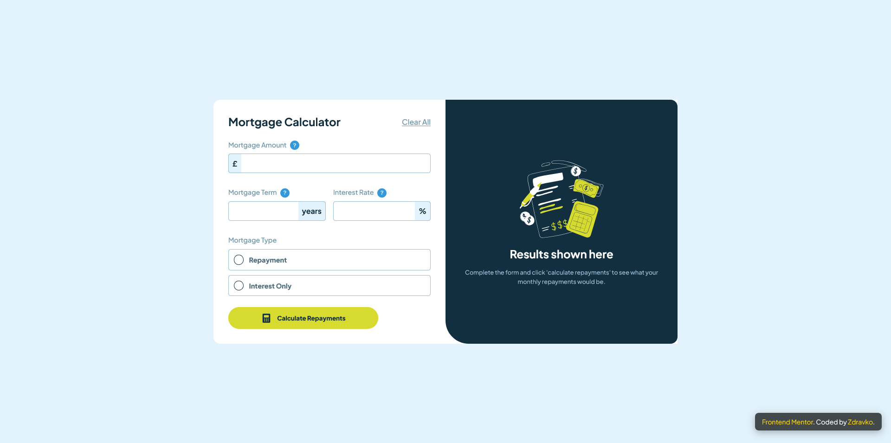

# Frontend Mentor - Mortgage repayment calculator solution

This is a solution to the [Mortgage repayment calculator challenge on Frontend Mentor](https://www.frontendmentor.io/challenges/mortgage-repayment-calculator-Galx1LXK73). Frontend Mentor challenges help you improve your coding skills by building realistic projects.

## Table of contents

- [Overview](#overview)
  - [The challenge](#the-challenge)
  - [Screenshot](#screenshot)
  - [Links](#links)
  - [Built with](#built-with)
  - [What I learned](#what-i-learned)
- [Useful Resources](#useful-resources)
- [Author](#author)

## Overview

### The challenge

Users should be able to:

- Input mortgage details and see monthly and total repayment amounts after submitting the form.
- View form validation messages if any fields are incomplete.
- See an optimized layout for the interface based on the device’s screen size.
- See hover and focus states for all interactive elements.

### Screenshot

### Links

- Solution URL: [Github](https://github.com/Zdravko93/mortgage-calculator-app)
- Live Site URL: [Live Demo](https://zdravko93.github.io/mortgage-calculator-app/)

### Built with

- Semantic HTML5 markup
- CSS custom properties
- Flexbox
- Mobile-first workflow
- GSAP for smooth animations

### What I learned

- Improved my skills in code refactoring.
- Developed a better sense of estimating project timelines.
- Integrated smooth, interactive animations using GSAP, enhancing the user experience. This includes animations on page load, as well as when a calculation is made. Additionally, the Author section is animated, providing a more dynamic feel to the page.

## Useful Resources

- [Frontend Mentor - Mortgage Repayment Calculator Challenge](https://www.frontendmentor.io/challenges/mortgage-repayment-calculator-Galx1LXK73) - The challenge that provided the foundation for this project.
- [GSAP (GreenSock Animation Platform)](https://gsap.com/docs/v3/) - A powerful library for creating smooth, interactive animations. I used this for all the animations in the project.
- [MDN Web Docs - Flexbox](https://developer.mozilla.org/en-US/) - An essential guide for working with Flexbox for responsive layouts.
- [CSS-Tricks](https://css-tricks.com/) - Using Custom Properties (CSS Variables) - Helpful resource for understanding CSS custom properties (variables) and how to use them in your projects.

- GSAP 
  
## Author

- Github - [Zdravko](https://github.com/Zdravko93)
- Frontend Mentor - [@Zdravko93](https://www.frontendmentor.io/profile/Zdravko93)
